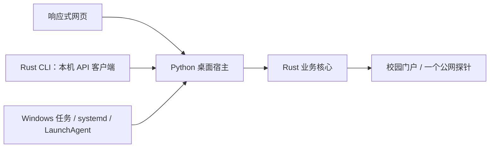

# 功能、接口与实现

本文对应桌面版 **2.0.0** 的实际代码。Android 已删除。认证、门户规则和检测决策只在 Rust 中实现；界面、系统运行和凭据存储归桌面宿主。

## 1. 唯一调用路径

| 职责 | 单个实现位置 |
| --- | --- |
| 配置模型、账号和门户校验 | [net.rs](../htu-toolbox-lib/src/net.rs)：`Config::validate`、`validate_portal` |
| 检测、认证、登出、定时决策 | 同文件：`check`、`login`、`logout`、`tick` |
| 唯一 HTTP 传输 | [http.rs](../htu-toolbox-lib/src/http.rs)：`request`，仅 GET / POST，禁代理和自动重定向，有限超时与响应大小 |
| 跨语言调用 | [lib.rs](../htu-toolbox-lib/src/lib.rs)：`htu_call` / `htu_free`；[core.py](../web/core.py)：ctypes 参数和结果转换 |
| 配置与密码存取 | [config.py](../web/config.py)：`ConfigStore`，Windows DPAPI / Unix Fernet 是对应系统的存储能力 |
| 执行器、启停与状态 | [runtime.py](../web/runtime.py)：`Controller`，所有系统共用一个执行器和操作锁 |
| 本机 HTTP 与日志读取 | [server.py](../web/server.py)：`DashboardHandler`、`read_log_tail` |
| 网页 | [index.html](../web/static/index.html)、[app.js](../web/static/app.js)、[styles.css](../web/static/styles.css)，一套配色和响应式布局 |
| CLI | [main.rs](../htu-toolbox-cli/src/main.rs)，只调用本机 API，无交互向导和独立配置 |
| 系统自启 | [install-user-service.py](../scripts/install-user-service.py)，每种系统一个宿主服务 |

## 2. 桌面 HTTP 接口

共五个业务路由。请求需本机 Host、匹配的服务端口及 `X-HTU-Token`；提供 Origin 时需同源。令牌由服务生成，网页从首页 meta 获取，CLI 从私有会话文件读取。

| 方法 / 路径 | 输入 | 唯一调用 | 结果与副作用 |
| --- | --- | --- | --- |
| `GET /api/status` | 无 | Controller 状态、配置摘要 | `{task,network,config,platform}`；只读缓存，不做网络请求 |
| `GET /api/detect-portal` | 无 | 核心 `detect-portal`，内部调用同一个 check | `{portalUrl}`；不保存、不认证 |
| `GET /api/logs?tail=N` | N 为 1—1000，默认 250 | `read_log_tail` | `{lines,lastWriteTime}`；展示和导出复用此结果 |
| `POST /api/config` | 配置 JSON | `ConfigStore.save` → 核心 validate | 保存后返回摘要；不安装系统服务，不启动执行器 |
| `POST /api/action` | `{"action":"…"}` | `Controller.action` | start / stop / check / login / logout |

首页 `GET /` 注入令牌；`GET /static/<文件>` 提供受路径限制的静态资源。JSON 成功结果为 `{ok:true,data?,message?}`，错误为 `{ok:false,error}`。参数、来源、令牌错误为 400，操作冲突为 409，未知路由为 404，POST 未预期异常为 500。

POST 只接受 JSON 对象，最大 64 KiB，拒绝 Transfer-Encoding。`/api/download-log`、restart、force-login 没有保留别名。

### 配置契约

| 字段 | 规则 | 默认值 |
| --- | --- | --- |
| account | ASCII 字母、数字、点、下划线、连字符；1—64，不含 `@` | 必填 |
| operator | yd / lt / dx / hsd | 必填 |
| portalUrl | http(s)、10.101.2.194、6060、/portal.do、非空查询参数；禁止 userinfo 和 fragment | 必填 |
| password | 首次必填，之后空字符串保留；非空不能全是空白，最多 128 字符 | 空字符串 |
| intervalSeconds | 整数 5—3600；拒绝 bool、浮点数和字符串 | 10 |
| autoStart | bool；系统启动是否恢复开启状态 | false |
| enabled | bool；仅 start/stop/logout 修改，配置 API 不允许直接设置 | false |

字段类型和业务规则由 Rust 校验，未知字段被拒绝。密码只在宿主内解密后传入核心；配置摘要不返回密码。配置采用原子替换，保存失败保留旧文件。

### 操作契约

| action | 实现 | 含义 |
| --- | --- | --- |
| check | 核心 check | 只检测；无需配置账号，不提交认证 |
| login | 宿主读取凭据 → 核心 login | 使用明确配置的门户，元数据 → 认证 → 公网验证；不改用其它门户或跳过协议步骤 |
| start | 宿主启动一个执行器 | 保存 enabled=true，立即执行第一次 tick；重复 start 不增加执行器 |
| stop | 宿主退出事件及配置存储 | 等待进行中的操作完成、保存 enabled=false，不再执行后续 tick；不登出 |
| logout | 停止执行器 → 核心 logout | 保存 enabled=false，再提交登出，避免后台重新登录 |

“保存并连接”在网页复用 save 和 start 两步。进程退出不改变 enabled；手动重开时恢复 enabled。系统启动带 `--autostart`，只有 autoStart=true 且 enabled=true 才恢复。凭据解密失败停止自动登录并报告错误，管理页面仍可用于重新保存密码。

## 3. 核心行为与外部接口

| 外部请求 | 唯一用途 / 判定 |
| --- | --- |
| GET `http://www.msftconnecttest.com/connecttest.txt` | 唯一公网探针；200 且正文逐字节等于 `Microsoft Connect Test` 为 online |
| 探针 Location / HTML 中的支持门户 | 核心校验后判定 captive；其它响应或请求失败为 error，不触发自动认证 |
| GET 同门户 `/PortalJsonAction.do?...&viewStatus=1` | 必需步骤，读取 serverForm.serverip / portalVer、portalconfig.id / timestamp / uuid |
| GET 同门户 `/quickauth.do?...` | userid=`account@operator`、passwd、门户参数与元数据；200 + code 字符串或数字 0 为接受 |
| POST `http://10.101.2.205/loginOut` | 空请求体；200 + result 整数 1 为登出成功 |

元数据映射 wlanacIp、version、portalpageid、timestamp、uuid。缺失或无效时在 metadata 阶段失败，不提交认证。HTTP 超时、非预期状态和 JSON 错误明确失败；错误信息不回显带密码的 URL 或服务器原始消息。

tick 使用 check：online 不认证，captive 调同一个 login，error 仅记录失败。核心返回下次等待秒数，宿主只负责等待和唤醒。失败按 1、2、4、8 倍检测间隔退避，上限为 max(intervalSeconds,60)；在线后清零。

网络结果包含 state、online、authenticated、checkedAt、message、errorStage、error、portalUrl、failures、nextDelay。认证接受和公网在线是两个独立字段，认证接受后探针失败仍保留 authenticated=true。所有时间以 Unix 秒表示。网页只展示最近结果与其时间，不会为刷新再次请求公网。

C ABI 只有 `htu_call(JSON)` 和 `htu_free(pointer)`。JSON 操作为 validate、runtime-dir、check、detect-portal、login、logout、tick；同一操作对应单个 Rust 实现。ctypes 不包含校园协议代码。配置与参数转换错误通过结构化错误返回，Rust 分配的结果由 Rust 释放。

## 4. CLI、宿主与系统入口

| 入口 | 对应实现 / 参数 |
| --- | --- |
| `python scripts/setup.py` | 准备 Python 虚拟环境、安装依赖、启动服务；`--install-only` 只准备，`--port` 指定端口 |
| `bash scripts/start.sh` | 只启动已有环境；参数透传到宿主 |
| `python -m web.server` | `--host` 只允许回环地址、`--port`、`--open-browser`、`--runtime-dir`、`--autostart` |
| CLI `net status / detect-portal / logs --tail N` | 对应三个 GET 路由 |
| CLI `net check / login / start / stop / logout` | 对应 action；请求失败时非零退出 |
| CLI `net set` | 从 stdin 读取 JSON，调用配置 API；不在 argv 传密码，不保存另一份配置 |
| `install-user-service.py [--port N]` | Windows 任务 HTU-Connect / systemd 用户服务 / LaunchAgent，只启动宿主 |
| `install-user-service.py --remove` | 停止并移除系统服务，保留配置 |

数据目录由 Rust runtime_dir 单独确定；默认使用当前用户系统数据目录下的 HTUConnect。绝对路径 `HTU_RUNTIME_DIR` 可覆盖，宿主和 CLI 的 `--runtime-dir` 指定同一位置。系统安装时保存该位置，不依赖未来进程继承安装器环境。

目录中只有一份 config.json、Unix credential.key、日志、单实例 service.lock 和服务运行期间的 session.json。服务按系统文件锁防止同目录多实例，不按旧 PID 文件盲目杀进程。CLI 只访问 127.0.0.1，失败不会切换到独立认证实现。

## 5. 构建、发布与已删除项

| 入口 | 实际实现 |
| --- | --- |
| [build-core.py](../scripts/build-core.py) | Cargo locked release 构建；输出平台动态库、CLI、版本 / 源码提交 / 文件 SHA-256 记录 |
| [package-release.py](../scripts/package-release.py) | 校验干净源码与原生构建记录，打包对应系统架构 ZIP 和 .sha256，不包含运行数据 |
| [build.yml](../.github/workflows/build.yml) | 三个桌面系统共用的构建、Rust/Python 检查及打包任务 |
| [verify.yml](../.github/workflows/verify.yml) | 调用同一构建工作流 |
| [release.yml](../.github/workflows/release.yml) | 仅标签触发，复用构建工作流；校验源码与下载产物后上传同一次构建结果 |

版本唯一来源为根 Cargo.toml 的 workspace.package.version，两个 Rust 包继承。原生文件只从 native/ 加载，运行时不自动编译或寻找其它目录。

已删除 Android 源码与独立 SDK 构建、PowerShell watcher / 门户检测 / 账号安装脚本、Python 网络实现和中间 launcher、Rust 独立 TOML 与交互向导、PUT 和忽略超时成功路径、重复日志下载、备用发布触发、两套配色和 Windows 专属 watchdog 表单。

不同操作系统的密码保护和服务注册保留必要系统适配，没有第二套认证策略、业务 provider 层或旧接口兼容分支。

## 6. 验证边界

Rust 测试覆盖门户白名单、配置、探针、元数据中止、认证参数、认证与在线分离、登出、失败退避和不完整响应。Python 测试经真实 ctypes 库和 CLI 验证 HTTP 契约、密码保护、原子保存、停止持久化、单实例、状态读取无探测、旧接口移除及系统服务参数。

系统服务参数生成使用模拟系统调用；真实校园网认证与系统登录后的自启需在对应设备验证。错误不会触发其它探针、旧门户、另一份凭据配置或另一套认证实现。
